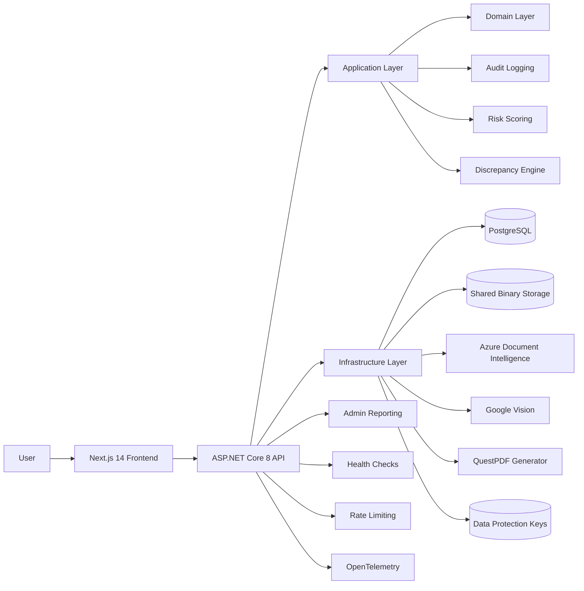

# PriceProof SA

PriceProof SA is a full-stack case-management platform for documenting pricing discrepancies between what a customer was shown before payment and what they were ultimately charged. It combines evidence capture, OCR, discrepancy analysis, complaint-pack generation, and merchant risk scoring in a single workflow designed for practical investigation rather than demo-only screenshots.

## Project Overview

The product goal is simple: make it easier to turn a frustrating pricing dispute into a structured, auditable case with evidence that can be reviewed by a merchant, a bank, or a consumer-protection channel.

The current implementation includes:
- a Next.js 14 frontend for the reporting workflow
- an ASP.NET Core 8 Web API built with clean architecture
- PostgreSQL persistence with EF Core
- OCR orchestration with provider abstraction and fallback
- complaint-pack PDF generation
- merchant and branch risk scoring
- admin reporting, audit logging, request correlation, rate limiting, and production auth hardening

## The South African Problem

In South Africa, a common real-world complaint is that the price displayed on a shelf, verbally quoted by staff, or shown during checkout does not always match the amount finally charged at the point of payment. In some cases the difference may be legitimate, but in others the cause is unclear to the customer and difficult to challenge after the fact.

Typical pain points include:
- a shelf or quoted price differs from the amount on the card machine
- a customer is told an extra amount is a "card fee" without clear proof
- the receipt is incomplete, unclear, or only available after payment
- a single complaint is easy to dismiss because the evidence is fragmented
- repeated patterns across a merchant or branch are hard to see without aggregation

PriceProof SA is built around that operational reality: capture evidence early, keep the language neutral, preserve traceability, and help users escalate with facts rather than emotion.

## Core Features

- Guided case creation flow from pre-payment evidence through complaint-pack generation
- Support for quoted-price evidence, payment evidence, and receipt evidence
- Receipt OCR with provider abstraction, retry handling, fallback, and normalized output
- Conservative discrepancy analysis with explanation text and confidence scoring
- Complaint-pack generation as both PDF and structured JSON
- Merchant and branch risk scoring with historical snapshots
- Email verification, password reset, account recovery, and lockout handling
- Shared database-backed binary storage for uploads and complaint packs
- Database-backed ASP.NET Data Protection key storage for multi-instance deployments
- Admin dashboard for case volume, OCR success, complaint-pack generation, and risky entities
- Audit logging for important user actions
- Request correlation IDs for traceability
- File upload validation, sanitization, and size limits
- Health checks, Serilog structured logging, API rate limiting, OpenTelemetry hooks, and deployment runbooks

## Architecture Diagram



## Solution Structure

- `src/PriceProof.Api`  
  HTTP entry point, middleware, controllers, health checks, rate limiting, and Serilog wiring.

- `src/PriceProof.Application`  
  Use cases, DTOs, validation, service contracts, audit orchestration, and application-level rules.

- `src/PriceProof.Domain`  
  Entities, enums, and domain services for discrepancy analysis, complaint narratives, and risk scoring.

- `src/PriceProof.Infrastructure`  
  EF Core persistence, PostgreSQL integration, OCR providers, PDF generation, shared binary storage, and session token handling.

- `tests/PriceProof.UnitTests`  
  Unit tests for core logic such as discrepancy detection, risk scoring, and OCR normalization.

- `tests/PriceProof.IntegrationTests`  
  Integration tests for the main API flows, uploads, OCR, risk endpoints, and complaint-pack generation.

- `src/frontend`  
  Next.js 14 frontend with TypeScript, Tailwind CSS, zod validation, and the mobile-first reporting experience.

## Tech Stack

### Backend
- ASP.NET Core 8 Web API
- C#
- EF Core 8
- PostgreSQL
- FluentValidation
- Serilog
- QuestPDF

### Frontend
- Next.js 14
- React
- TypeScript
- Tailwind CSS
- zod

### Testing
- xUnit
- FluentAssertions
- ASP.NET Core integration testing with `WebApplicationFactory`

### Operational concerns
- Docker and Docker Compose
- Health checks
- Request correlation IDs
- Rate limiting
- Structured audit logging
- OpenTelemetry tracing and metrics
- CI/CD workflow files
- Backup and restore runbooks

## Setup

### Prerequisites
- .NET 8 SDK
- Node.js 20+
- PostgreSQL 16+ or Docker Desktop

### Option 1: Docker for the full stack

From the repository root:

```powershell
docker compose up --build
```

This starts:
- PostgreSQL on `5432`
- the API on `8080`
- the frontend on `3000`

For containerized environments, mount an untracked secret config file under `infra/secrets/` before starting the stack.

### Option 2: Run services locally

1. Start PostgreSQL locally.
2. Keep machine-specific settings in an ignored override file such as `appsettings.Local.json` or `appsettings.Secrets.json` under `src/PriceProof.Api`.
3. Run the API:

```powershell
dotnet run --project .\src\PriceProof.Api\PriceProof.Api.csproj
```

4. Run the frontend:

```powershell
Set-Location .\src\frontend
npm.cmd install
npm.cmd run dev
```

### Default local URLs
- Frontend: `http://localhost:3000`
- API: `http://localhost:8080`
- Health check: `http://localhost:8080/health`

## Secure Configuration

This repository intentionally keeps secret-bearing runtime values out of source control.

Recommended approaches:
- local development: use an ignored `appsettings.Local.json` or `appsettings.Secrets.json`
- containerized deployment: mount a secret JSON file to `/run/secrets/priceproof.api.json`
- hosted deployment: map secure platform secrets to the equivalent ASP.NET Core configuration keys

Do not commit database credentials, OCR provider keys, SMTP credentials, bootstrap-admin passwords, or production callback URLs into the repository.

## Screenshot Placeholders

Add actual screenshots under `docs/screenshots/` when presenting the project publicly.

| Screen | Suggested file |
| --- | --- |
| Landing page | `docs/screenshots/landing-page.png` |
| Sign in / sign up | `docs/screenshots/auth.png` |
| Dashboard | `docs/screenshots/dashboard.png` |
| New case wizard | `docs/screenshots/new-case-wizard.png` |
| Case details | `docs/screenshots/case-details.png` |
| Merchant history | `docs/screenshots/merchant-history.png` |
| Settings | `docs/screenshots/settings.png` |
| Admin dashboard | `docs/screenshots/admin-dashboard.png` |

## API Endpoint Summary

### Auth
- `POST /auth/sign-up`
- `POST /auth/sign-in`
- `POST /auth/email-verification/request`
- `POST /auth/email-verification/confirm`
- `POST /auth/password-reset/request`
- `POST /auth/password-reset/confirm`
- `POST /auth/account-recovery`
- `POST /auth/sign-out`
- `GET /auth/me`

### Lookups
- `GET /lookups/bootstrap`

### Cases
- `POST /cases`
- `GET /cases`
- `GET /cases/{id}`
- `POST /cases/{id}/analyze`
- `POST /cases/{id}/generate-complaint-pack`

### Evidence
- `POST /uploads`
- `GET /uploads/content`
- `POST /price-captures`
- `POST /payment-records`
- `POST /receipt-records`
- `POST /receipt-records/{id}/run-ocr`

### Complaint packs
- `GET /complaint-packs/{id}/download`

### Merchants and branches
- `GET /merchants/{id}/history`
- `GET /merchants/{id}/risk`
- `GET /branches/{id}/risk`
- `GET /risk/overview`

### Admin dashboard
- `GET /admin/dashboard/summary`
- `GET /admin/dashboard/merchants`
- `GET /admin/dashboard/branches`
- `GET /admin/dashboard/recent-uploads`
- `GET /admin/dashboard/export/csv`

## Testing

### Backend

```powershell
dotnet build .\src\PriceProof.Api\PriceProof.Api.csproj
dotnet test .\tests\PriceProof.UnitTests\PriceProof.UnitTests.csproj
dotnet test .\tests\PriceProof.IntegrationTests\PriceProof.IntegrationTests.csproj
```

If you hit MSBuild node-reuse issues in a constrained shell or CI sandbox, run:

```powershell
dotnet build .\src\PriceProof.Api\PriceProof.Api.csproj -m:1 /nr:false
dotnet test .\tests\PriceProof.UnitTests\PriceProof.UnitTests.csproj -m:1 /nr:false
dotnet test .\tests\PriceProof.IntegrationTests\PriceProof.IntegrationTests.csproj -m:1 /nr:false
```

### Frontend

```powershell
Set-Location .\src\frontend
npm.cmd run build
npm.cmd test -- --runInBand
```

## Production Operations

- OpenTelemetry collector config: `infra/monitoring/otel-collector-config.yaml`
- Prometheus scrape config: `infra/monitoring/prometheus.yml`
- Alert rules: `infra/monitoring/alerts/priceproof-alerts.yml`
- Backup and restore scripts: `infra/scripts/backup-postgres.ps1`, `infra/scripts/restore-postgres.ps1`, `infra/scripts/backup-postgres.sh`, and `infra/scripts/restore-postgres.sh`
- Runbooks: `docs/runbooks/backup-and-restore.md`, `docs/runbooks/monitoring-and-alerting.md`, and `docs/runbooks/production-deployment.md`
- CI workflow: `.github/workflows/ci.yml`
- Production deployment workflow: `.github/workflows/deploy-production.yml`

## Roadmap

- Add MFA or passwordless second-factor support for high-trust accounts
- Introduce a proper evidence-retention policy and configurable data lifecycle
- Expand complaint-pack export targets beyond PDF and JSON
- Add richer OCR quality scoring and document quality hints before upload
- Add explicit dismissed/resolved workflows for analysts and admins
- Improve trend analysis and anomaly detection for merchant risk scoring
- Add cloud object-storage and background job providers alongside the current shared database-backed deployment option

## Legal Disclaimer

PriceProof SA is a technical evidence-management tool. It does not provide legal advice, banking advice, or regulatory determinations. Complaint text generated by the system is intended to be factual and neutral, but users remain responsible for reviewing any submission before sending it to a merchant, bank, regulator, or public authority.

The platform should be used to organize and present evidence, not to make defamatory claims or substitute for formal legal counsel.

## Why This Project Is Strong For Interviews

This project is a good interview artifact because it shows more than CRUD.

It demonstrates:
- a clean separation between domain, application, API, and infrastructure concerns
- a realistic end-to-end workflow spanning uploads, OCR, analysis, document generation, and admin reporting
- practical backend hardening through validation, rate limiting, audit logging, correlation IDs, and safe error handling
- production-minded tradeoffs, including conservative classification, provider abstraction, and fallback behavior
- meaningful tests at both unit and integration levels
- a full-stack perspective, with a real frontend wired to actual backend flows rather than mocked demos

In other words, it is the kind of project that creates useful discussion in interviews: architecture choices, operational safety, domain modeling, testing strategy, and how to evolve a system from a usable MVP toward a production-grade service.
